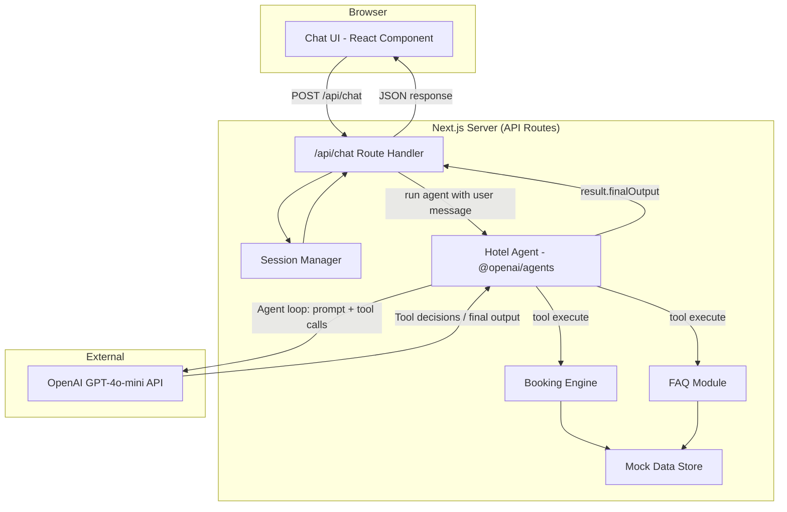

# Design Document: Hotel AI Chat Assistant

## Overview

The Hotel AI Chat Assistant is a single-page web application that provides a conversational interface for guests of Saltystaz Gurgaon. It uses GPT-4o-mini via the **OpenAI Agents SDK** (`@openai/agents` npm package) to power natural language understanding and response generation. The Agent SDK provides a declarative way to define an AI agent with tools — the SDK's built-in agent loop automatically handles tool invocation, feeds results back to the model, and continues until a final text response is produced. The system operates entirely on mock data, making it self-contained and suitable for demonstration without any external hotel backend.

The assistant is named **Sophia** and strictly only answers hotel-related queries (bookings, availability, policies, amenities). Off-topic questions are politely redirected.

**Key Design Decisions:**
- **Next.js (App Router)** for the full-stack framework — provides both the React frontend and API routes in a single deployable unit, minimizing setup for a 1-week PoC
- **TypeScript** throughout for type safety and better developer experience
- **In-memory mock data store** initialized on server start with 90 days of availability — no database required
- **OpenAI Agents SDK** (`@openai/agents`) for agent-based interactions — uses the `Agent` primitive with `tool()` definitions and the built-in agent loop (`run()`) instead of manual chat completions and function calling
- **GPT-4o-mini** as the model (configurable based on API key access)
- **Dynamic system prompt** that includes today's date for resolving relative dates ("tomorrow", "next week")
- **Server-side session management** using an in-memory map keyed by session ID (no persistence needed for a demo)
- **Tailwind CSS** for rapid UI styling
- **Zod** for runtime schema validation (used by `@openai/agents` tool parameter definitions)
- **Strict topic boundary** — the agent only responds to hotel-related queries and politely declines off-topic questions

**Rationale:** This stack minimizes infrastructure complexity. A single `npm run dev` command starts the entire application. No database, no Redis, no external services beyond the OpenAI API. The Agents SDK further simplifies the GPT integration — no manual function calling orchestration, no tool result re-injection, no conversation loop management.

## Architecture



### Request Flow

1. Guest types a message in the Chat UI
2. Frontend sends `POST /api/chat` with `{ sessionId, message }`
3. API route handler retrieves or creates a session via Session Manager
4. The system constructs the input for the agent:
   - Conversation history (up to 50 messages) is serialized as context
   - Current guest message is passed as the user input to `run()`
5. The Agent SDK's `run()` function executes the agent loop:
   - GPT-4o-mini decides whether to call a tool or produce a text response
   - If a tool is called (e.g., `check_availability`, `create_booking`), the SDK automatically invokes the tool's `execute` function, feeds the result back to the model, and loops
   - This continues until the model produces a final text output (no more tool calls)
6. The final output is extracted from `result.finalOutput`
7. Response is stored in session history and returned to the frontend

### Agent-Based Tool Strategy

Rather than building separate NLP classifiers or manually orchestrating function calls, the design leverages the **OpenAI Agents SDK** agent loop:

- A single `Agent` instance is configured with the hotel system prompt, GPT-4o-mini model, and a set of tools
- Tools are defined declaratively using `tool()` with Zod schemas for parameters
- The SDK handles the entire tool-calling lifecycle automatically:
  1. Model decides to call a tool → SDK invokes `execute()`
  2. Tool result is fed back to the model
  3. Model decides to call another tool or produce final text
- Available tools:
  - **`check_availability`** — called when guest asks about room availability
  - **`create_booking`** — called when guest confirms a reservation
  - **`cancel_booking`** — called when guest requests cancellation
  - **`get_hotel_info`** — called when guest asks FAQ/policy questions

This approach offloads intent classification to GPT-4o-mini itself and eliminates all manual function-calling orchestration code.

## Components and Interfaces

### 1. Chat UI (`app/page.tsx`)

The single-page chat interface built with React.

```typescript
interface ChatMessage {
  id: string;
  role: 'user' | 'assistant' | 'system';
  content: string;
  timestamp: Date;
}

interface ChatState {
  messages: ChatMessage[];
  sessionId: string | null;
  guestName: string | null;
  isLoading: boolean;
  error: string | null;
}
```

**Responsibilities:**
- Render conversation history in chronological order
- Send messages to `/api/chat`
- Display loading state while waiting for response
- Auto-scroll to latest message
- Handle session initialization (name prompt + welcome greeting)

### 2. API Route Handler (`app/api/chat/route.ts`)

```typescript
interface ChatRequest {
  sessionId?: string;
  message: string;
}

interface ChatResponse {
  sessionId: string;
  reply: string;
  metadata?: {
    bookingConfirmation?: BookingConfirmation;
    sessionExpired?: boolean;
  };
}
```

**Responsibilities:**
- Validate incoming request (message length ≤ 1000 chars, non-empty)
- Manage session lifecycle (create, retrieve, expire)
- Invoke the hotel agent via `run()` with conversation history and current message
- Extract `result.finalOutput` as the reply
- Return formatted response

### 3. Session Manager (`lib/session-manager.ts`)

```typescript
interface Session {
  id: string;
  guestName: string | null;
  messages: ChatMessage[];
  createdAt: Date;
  lastActivityAt: Date;
  bookings: BookingRecord[];
  state: 'awaiting_name' | 'active';
}

interface SessionManager {
  createSession(): Session;
  getSession(id: string): Session | null;
  isExpired(session: Session): boolean;
  addMessage(sessionId: string, message: ChatMessage): void;
  clearSession(sessionId: string): Session;
}
```

**Responsibilities:**
- Create new sessions with unique IDs
- Track session state (awaiting name vs active)
- Enforce 50-message history limit (FIFO eviction)
- Detect 30-minute inactivity timeout
- Handle session reset on "start over" / "reset conversation"

### 4. Booking Engine (`lib/booking-engine.ts`)

```typescript
interface BookingRequest {
  checkInDate: string;   // ISO date string
  checkOutDate: string;  // ISO date string
  roomType: string;
  guestName: string;
}

interface BookingConfirmation {
  confirmationNumber: string;
  roomType: string;
  checkInDate: string;
  checkOutDate: string;
  pricePerNight: number;
  totalCost: number;
  guestName: string;
}

interface BookingEngine {
  checkAvailability(checkIn: string, checkOut: string, roomType?: string): AvailableRoom[];
  createBooking(request: BookingRequest): BookingConfirmation;
  cancelBooking(confirmationNumber: string, sessionId: string): boolean;
  validateDates(checkIn: string, checkOut: string): DateValidationResult;
}
```

**Responsibilities:**
- Validate date ranges (check-out after check-in, check-in not in past)
- Query Mock Data Store for availability
- Create reservation records with confirmation numbers
- Decrement available units on booking
- Handle cancellation within the same session

### 5. FAQ Module (`lib/faq-module.ts`)

```typescript
interface FAQModule {
  getHotelInfo(topic: string): string | null;
  getCheckInTime(): string;
  getCheckOutTime(): string;
  getAmenities(): Amenity[];
  getPolicy(policyType: string): string | null;
  getRoomPricing(): RoomType[];
}
```

**Responsibilities:**
- Retrieve information from Mock Data Store by topic
- Return structured data for GPT to format in the appropriate tone
- Return null for topics not covered (triggers "contact front desk" response)

### 6. Mock Data Store (`lib/mock-data.ts`)

```typescript
interface MockDataStore {
  roomTypes: RoomType[];
  availability: Map<string, Map<string, number>>; // roomType -> date -> units
  policies: HotelPolicies;
  amenities: Amenity[];
  bookings: BookingRecord[];
}

interface MockDataStoreAPI {
  initialize(): void;
  getRoomTypes(): RoomType[];
  getAvailability(roomType: string, date: string): number;
  decrementAvailability(roomType: string, date: string): boolean;
  getPolicies(): HotelPolicies;
  getAmenities(): Amenity[];
  addBooking(booking: BookingRecord): void;
  cancelBooking(confirmationNumber: string): boolean;
}
```

**Responsibilities:**
- Initialize with realistic hotel data on startup
- Provide room types, availability, policies, and amenities
- Mutate availability on booking/cancellation
- No persistence — resets on server restart

### 7. Hotel Agent (`lib/hotel-agent.ts`)

```typescript
import { Agent, tool } from '@openai/agents';
import { z } from 'zod';

// Tool definitions using the Agents SDK tool() helper
const checkAvailabilityTool = tool({
  name: 'check_availability',
  description: 'Check room availability for given dates',
  parameters: z.object({
    checkInDate: z.string().describe('Check-in date in YYYY-MM-DD format'),
    checkOutDate: z.string().describe('Check-out date in YYYY-MM-DD format'),
    roomType: z.string().optional().describe('Optional preferred room type'),
  }),
  async execute(args) {
    // Calls BookingEngine.checkAvailability()
  },
});

const createBookingTool = tool({
  name: 'create_booking',
  description: 'Create a room reservation',
  parameters: z.object({
    checkInDate: z.string(),
    checkOutDate: z.string(),
    roomType: z.string(),
    guestName: z.string(),
  }),
  async execute(args) {
    // Calls BookingEngine.createBooking()
  },
});

const cancelBookingTool = tool({
  name: 'cancel_booking',
  description: 'Cancel an existing reservation',
  parameters: z.object({
    confirmationNumber: z.string(),
  }),
  async execute(args) {
    // Calls BookingEngine.cancelBooking()
  },
});

const getHotelInfoTool = tool({
  name: 'get_hotel_info',
  description: 'Get hotel information (amenities, policies, pricing, check-in/out times)',
  parameters: z.object({
    topic: z.enum([
      'check_in_time', 'check_out_time', 'amenities',
      'cancellation_policy', 'pet_policy', 'smoking_policy',
      'parking', 'room_pricing',
    ]),
  }),
  async execute(args) {
    // Calls FAQModule.getHotelInfo()
  },
});

// Agent definition
const hotelAgent = new Agent({
  name: 'Hotel Assistant',
  model: 'gpt-4o-mini',
  instructions: () => getSystemPrompt(), // Dynamic — includes today's date
  tools: [checkAvailabilityTool, createBookingTool, cancelBookingTool, getHotelInfoTool],
});

// Usage in the API route:
// import { run } from '@openai/agents';
// const result = await run(hotelAgent, agentInput, { context });
// const reply = result.finalOutput;
```

**Responsibilities:**
- Define the hotel assistant agent (named "Sophia") with dynamic system prompt, model, and tools
- System prompt includes today's date for resolving relative dates ("tomorrow", "2 nights")
- Strictly limits responses to hotel-related topics only
- Each tool's `execute` function delegates to the appropriate module (Booking Engine, FAQ Module)
- The agent loop (via `run()`) handles multi-step tool invocations automatically
- Conversation history is formatted as `AgentInputItem[]` for multi-turn context
- No manual conversation loop or function-call re-injection needed

## Data Models

### Room Type

```typescript
interface RoomType {
  id: string;
  name: string;            // e.g., "Deluxe Room", "Executive Suite", "Presidential Suite"
  description: string;
  maxGuests: number;       // 1-10
  pricePerNight: number;   // in INR
  amenities: string[];     // room-specific amenities
}
```

### Availability Record

```typescript
// Stored as: Map<roomTypeId, Map<dateString, availableUnits>>
// dateString format: "YYYY-MM-DD"
// availableUnits: number >= 0
```

### Hotel Policies

```typescript
interface HotelPolicies {
  checkInTime: string;      // e.g., "2:00 PM"
  checkOutTime: string;     // e.g., "12:00 PM"
  cancellation: string;     // policy text
  pets: string;             // policy text
  smoking: string;          // policy text
  parking: string;          // policy text
}
```

### Amenity

```typescript
interface Amenity {
  name: string;
  description: string;
}
```

### Booking Record

```typescript
interface BookingRecord {
  confirmationNumber: string;  // e.g., "STZ-20250101-001"
  sessionId: string;
  guestName: string;
  roomType: string;
  checkInDate: string;
  checkOutDate: string;
  pricePerNight: number;
  totalCost: number;
  status: 'confirmed' | 'cancelled';
  createdAt: Date;
}
```

### Date Validation Result

```typescript
interface DateValidationResult {
  valid: boolean;
  error?: 'checkout_before_checkin' | 'checkin_in_past' | 'invalid_format';
  message?: string;
}
```

### Agent Tool Definitions (Zod Schemas)

The tools are defined using `tool()` from `@openai/agents` with Zod schemas for parameter validation. The full definitions live in `lib/hotel-agent.ts` (see Components section above). Below are the schemas for reference:

```typescript
import { z } from 'zod';

// check_availability parameters
const checkAvailabilityParams = z.object({
  checkInDate: z.string().describe('Check-in date in YYYY-MM-DD format'),
  checkOutDate: z.string().describe('Check-out date in YYYY-MM-DD format'),
  roomType: z.string().optional().describe('Optional preferred room type'),
});

// create_booking parameters
const createBookingParams = z.object({
  checkInDate: z.string(),
  checkOutDate: z.string(),
  roomType: z.string(),
  guestName: z.string(),
});

// cancel_booking parameters
const cancelBookingParams = z.object({
  confirmationNumber: z.string(),
});

// get_hotel_info parameters
const getHotelInfoParams = z.object({
  topic: z.enum([
    'check_in_time', 'check_out_time', 'amenities',
    'cancellation_policy', 'pet_policy', 'smoking_policy',
    'parking', 'room_pricing',
  ]),
});
```


## Correctness Properties

*A property is a characteristic or behavior that should hold true across all valid executions of a system — essentially, a formal statement about what the system should do. Properties serve as the bridge between human-readable specifications and machine-verifiable correctness guarantees.*

### Property 1: Session history maintains a bounded sliding window

*For any* sequence of N messages added to a conversation session, the session SHALL retain exactly min(N, 50) messages, and those messages SHALL be the N most recently added messages in their original order.

**Validates: Requirements 1.2, 6.2**

### Property 2: Session expiry is determined by inactivity duration

*For any* conversation session with a `lastActivityAt` timestamp, the session SHALL be classified as expired if and only if the elapsed time between `lastActivityAt` and the current time exceeds 30 minutes.

**Validates: Requirements 1.5, 6.5**

### Property 3: Whitespace-only messages are rejected

*For any* string composed entirely of whitespace characters (spaces, tabs, newlines, or empty string), the message validation function SHALL reject the message and return an error indicating the guest should enter a valid message.

**Validates: Requirements 1.6**

### Property 4: Date validation rejects invalid booking dates

*For any* pair of dates where the check-out date is on or before the check-in date, OR the check-in date is before today's date, the date validation function SHALL return an invalid result with the appropriate error type (`checkout_before_checkin` or `checkin_in_past`).

**Validates: Requirements 3.6, 3.7**

### Property 5: Availability results are capped at 3 options

*For any* availability query against the Mock Data Store, regardless of how many room types have available units, the returned results SHALL contain at most 3 room options.

**Validates: Requirements 3.3**

### Property 6: Booking creation produces a valid record and decrements availability

*For any* valid booking request (valid dates, available room type), the Booking Engine SHALL produce a confirmation containing a non-empty confirmation number, the correct room type, matching dates, correct price per night, and accurate total cost (price × number of nights), AND the Mock Data Store SHALL have availability decremented by exactly 1 for the specified room type on each date in the reserved range.

**Validates: Requirements 3.4, 5.6**

### Property 7: Booking cancellation restores availability

*For any* confirmed booking that is cancelled within the same session, the booking status SHALL change to 'cancelled' AND the Mock Data Store SHALL have availability incremented by exactly 1 for the specified room type on each date that was previously reserved.

**Validates: Requirements 3.8**

## Error Handling

### API-Level Errors

| Error Condition | Response | HTTP Status |
|----------------|----------|-------------|
| Empty/whitespace message | `{ error: "Please enter a message" }` | 400 |
| Message exceeds 1000 characters | `{ error: "Message too long. Please keep it under 1000 characters." }` | 400 |
| Invalid session ID | Create new session, respond normally | 200 |
| Session expired (30 min) | `{ reply: "...", metadata: { sessionExpired: true } }` | 200 |
| OpenAI API timeout (>10s) | `{ error: "I'm having trouble responding right now. Please try again." }` | 503 |
| OpenAI API rate limit | `{ error: "I'm a bit busy right now. Please try again in a moment." }` | 429 |
| OpenAI API auth failure | `{ error: "Service configuration error. Please contact support." }` | 500 |
| Agent `run()` throws error | `{ error: "I'm having trouble responding right now. Please try again." }` | 503 |
| Mock Data Store error | `{ error: "Unable to retrieve information. Please contact the front desk." }` | 500 |

### Client-Side Error Handling

- Display error messages in the chat as system messages (visually distinct from assistant messages)
- On network failure, show a retry button
- On session expiry, automatically start a new session and notify the guest

### Graceful Degradation

- If the agent's tool execution fails (e.g., Booking Engine throws), the tool returns an error string which the model uses to produce a helpful response asking the guest to rephrase or try again
- If the `run()` call itself fails (network issues, rate limits), the API route catches the error and returns an appropriate HTTP error response
- If the Mock Data Store somehow becomes inconsistent (e.g., negative availability), prevent the booking and inform the guest no rooms are available
- Never expose internal error details (stack traces, API keys) to the guest

## Testing Strategy

### Unit Tests (Example-Based)

Unit tests cover specific scenarios, edge cases, and integration points:

- **Session Manager**: Create session, retrieve session, add messages, session reset, expiry detection
- **Booking Engine**: Specific booking scenarios (valid booking, invalid dates, no availability, cancellation)
- **FAQ Module**: Each policy lookup, amenity retrieval, unknown topic handling
- **Mock Data Store**: Initialization validation (3 room types, 90 days availability, 5 amenities, all policies)
- **Input Validation**: Specific empty/whitespace/overlength message cases
- **Date Validation**: Specific date edge cases (same day check-in/out, boundary dates)

### Property-Based Tests (fast-check)

Property-based tests validate universal correctness properties using the `fast-check` library with minimum 100 iterations per property:

| Property | Test Description | Tag |
|----------|-----------------|-----|
| 1 | Generate random message sequences (1-200 messages), verify 50-message cap and FIFO order | Feature: hotel-ai-chat-assistant, Property 1: Session history bounded sliding window |
| 2 | Generate random timestamps with varying gaps, verify expiry classification | Feature: hotel-ai-chat-assistant, Property 2: Session expiry by inactivity duration |
| 3 | Generate random whitespace-only strings, verify rejection | Feature: hotel-ai-chat-assistant, Property 3: Whitespace-only messages rejected |
| 4 | Generate random invalid date pairs, verify correct error classification | Feature: hotel-ai-chat-assistant, Property 4: Date validation rejects invalid dates |
| 5 | Generate random availability data with 1-10 room types, verify results ≤ 3 | Feature: hotel-ai-chat-assistant, Property 5: Availability results capped at 3 |
| 6 | Generate random valid bookings, verify confirmation fields and availability decrement | Feature: hotel-ai-chat-assistant, Property 6: Booking creation valid record and decrement |
| 7 | Generate random bookings then cancel, verify status change and availability restoration | Feature: hotel-ai-chat-assistant, Property 7: Cancellation restores availability |

### Integration Tests

Integration tests verify end-to-end behavior with the OpenAI Agents SDK (agent and tools mocked for CI):

- Full conversation flow: name → welcome → question → response
- Booking flow: inquiry → details → availability → confirmation
- Tone matching: formal input → formal response, casual input → casual response
- Session timeout and restart flow
- Error scenarios with mocked `run()` failures (timeout, rate limit, auth)
- Verify tool execution is delegated correctly (mock the `execute` functions)

### Test Configuration

```typescript
// fast-check configuration
const fcConfig = {
  numRuns: 100,        // minimum iterations per property
  seed: Date.now(),    // reproducible on failure
  verbose: true        // show counterexamples
};
```

### Test Framework

- **Jest** or **Vitest** as the test runner
- **fast-check** for property-based testing
- **MSW (Mock Service Worker)** for mocking OpenAI API calls made by the Agents SDK in integration tests
- **React Testing Library** for UI component tests
- **Zod** schemas ensure tool parameter validation is tested implicitly via the SDK
